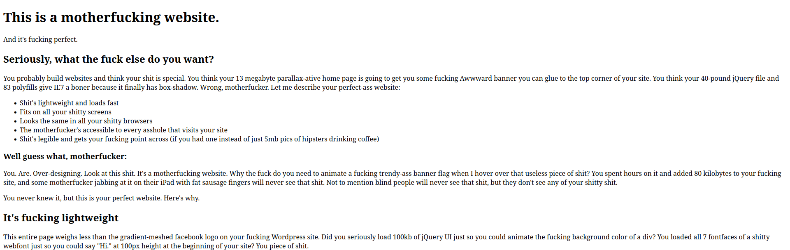
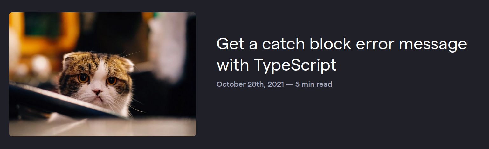

There's a growing subculture on the internet dubbed by some as the "minimalist web". It's a group of people with websites that have grown tired and disillusioned with the slow, bloated state of the modern web. Instead of building websites with the next big JavaScript framework, loading in a carousel on the home page powered by jQuery, or bringing in a 500KB image just as a background image, the minimalist web is the internet equivalent of the saying "less is more".

You've probably seen plenty of these sites before in the wild. These are the text-only blogs and simple, artisanal websites. You may have seen them showcased in something like the [512KB Club](https://512kb.club/), a showcase of websites with a total page size of less than 512KB.

Don't get me wrong, I love the concept. This website can also be considered part of the "minimalist web".

But you can take the minimalist spirit too far. Some websites, in their quest for website purity, end up with ugly or even unusable websites.

What am I talking about?

I think the issue can best be understood by taking a look at [this classic website](https://motherfuckingwebsite.com/) (warning, strong language). This is one of the most commonly cited inspirations for a lot of personal websites I see in the wild.

If you haven't experienced this website before, this is a tongue-in-cheek screed against the modern web. This website was created in the days when every website was using a bloated WordPress theme with jQuery animations and five different webfonts. (It's only grown more relevant over time.) It's meant to be the complete antithesis to the websites of its time. There's no styling, it's a simple HTML page because *that's all you really need to build a website!* From one extreme to the other, this hyper-minimalist website got as much attention as it did because it did the complete opposite of the rest of the maximalist web.

The problem is when people take this website too seriously. It's meant to be a *satire*--it even says as much right on the website!

> "I'm not actually saying your shitty site should look like this. What I'm saying is that all the problems we have with websites are ones we create ourselves. Websites aren't broken by default, they are functional, high-performing, and accessible. You break them."

But I think a lot of people have taken away the wrong message from this site. The point is *not* to make your website as minimal as possible. It's that all of the problems with the modern web are self-created. If your website is slow, inaccessible, and broken, it's because of something *you* did wrong. Take responsibility.

But in the name of minimalism, I've seen a lot of atrocious websites being created based on the misunderstanding of the philosophy of this website. If you try to simply make your website as *minimal as possible*, you usually end up with an ugly, unreadable, and unappealing website.

## Minimalist websites don't have to be unreadable

I understand the nostalgia for the 90s internet. The web was more fun and creative back then. So oftentimes you'll see some spartan web design meant to invoke some feeling of the "good old days".

But can we please at least put to rest the terrible typography of the "good old days"?

I see so many websites that are just painful to read. I'm talking about `16px` font size and lines of text that are at the same time both too scrunched together and too wide. Reading these websites is an absolute chore. If your website is this difficult to read, how long do you think I'm going to spend reading it? Not long.

I get it, we're not all designers, nor do we all want to be. But you need to have some design sense just to make the website pleasant enough for anyone to actually want to read it.

We don't have 800x600 resolution monitors anymore. So why are we still using the web design of websites that were designed for these monitors?

I don't want to have to squint or strain to read your website. And I have 20/20 vision! Imagine all of your users that *don't* have perfect vision. (It's more than you might think.)

It's really not that difficult to make your website more readable. Just add more white space, increase the `font-size` to something like `18px` (or even `20px` if you're feeling crazy), and keep the length of the lines reasonable (something like 80 characters wide or less is often recommended).

## Minimalist websites don't have to be ugly

I personally don't get the obsession with text-only websites. I get it, you like the minimalist aesthetic. Maybe you don't want to show your face online. I understand. But the internet is inherently a visual medium, so why not take advantage of it?

I can understand if you don't want to put irrelevant images just for the sake of putting images on your website. Have you ever seen these coding blogs that put the most random images from [Unsplash](https://unsplash.com) next to some technical tutorial just to have something to look at?

But if you're deliberately not putting images in places where it serves your content? I think you're doing a disservice to your readers. Is it really worth the 50-100KB you've saved not including an image to make your content clearer and more visually appealing? We're humans; we're hard-wired to like pretty things. Why not make your website look nice?

I'm also tired of the boring white text on an off-black background with a fixed-width minimalist web design. Every blog looks the same. It's *boring*. I know this website isn't winning any design awards either, but I try to make it a little more visually interesting than most websites. I understand a lot of people in the minimalist web space (including myself) aren't exactly designers or don't like working in CSS. That's fine. But there are plenty of themes for almost any framework you could be using for your website. ([Hugo](https://themes.gohugo.io/)? [Astro](https://astro.build/themes/)?) From there, you can tweak as much or as little as you want, once you find something that looks good.

You can also take advantage of minimal CSS frameworks. I personally really like [Simple.css](https://simplecss.org/), which is basically a pre-made, customizable CSS theme for your website, if you want your website to look good without thinking too much about it. This is just one example, though; there are [hundreds of similar](https://github.com/dbohdan/classless-css) "minimal CSS frameworks" you can find that might suit your tastes more.

But of course, the best way to make your site look good is to *steal* your CSS. My website's CSS is hand-crafted, but there are a lot of snippets in there from various different websites and frameworks. If you find a website that you really like the design or typography from, all you have to do is open up the dev tools in your browser and find the CSS that makes something look so good. As long as you don't completely rip off someone else's website design, it's perfectly fine to take little snippets from various websites and build sort of a Franken-design. [*It's alive!*](https://www.youtube.com/watch?v=0VkrUG3OrPc)

## Minimalist websites don't have to be anti-JavaScript

To some developers, JavaScript is the devil. With all the abuse of JavaScript, it's easy to see why it has its reputation. But there's nothing wrong with using some JavaScript, and there's a good chance using a bit of JavaScript will make your website even better.

Have a gigantic list of blog posts or something similar on your website? Give your visitors the ability to sort it with JavaScript. Take [Derek Sivers's book list](https://sive.rs/book). You can instantly sort this massive list by date, by rating, or alphabetically. How much less usable would this list be if it wasn't for JavaScript?

I even like [this more complex version of the same thing by Marc Jenkins](https://marcjenkins.co.uk/bookshelf/). It even loads a *JavaScript library* to provide cool animations! And yet, I think it adds a lot to the website. The script only loads in on one page and it's only 23KB over the wire. I would still consider this a minimalist website and it still respects the user. (Although I would recommend adding `loading="lazy"` to the images.)

If JavaScript is disabled, these sorting features don't work, but the list of books remains. I would avoid using JavaScript for any critical features of your website, for example, a hamburger menu that won't open without JavaScript. But when JavaScript is used to "enhance" a website or a webpage that already works fine without it, I think it can add a lot to a website.

Want to include JavaScript-powered analytics on your website? Go ahead! (But please use [something privacy-respecting](https://www.youtube.com/watch?v=9x8w9igz7Ew).) I've written [why I don't use analytics on this website](/blog/no-analytics), but I've seen some weird web purists decry the practice outright. If you find analytics useful, use them! You're not going to be deemed unworthy by some imagined anti-JavaScript police for using them.

## Make the web better

I realize this list might be common sense to a lot of people, but I wanted to offer a different perspective than a lot of the dogmatism I see on some websites. Too often I see a lot of websites that are little more than a measuring contest to see who can get the smallest page bundle. But for me, one of the most interesting things about the independent web is that you have so much creative freedom to show off what the web is capable of. Use it!