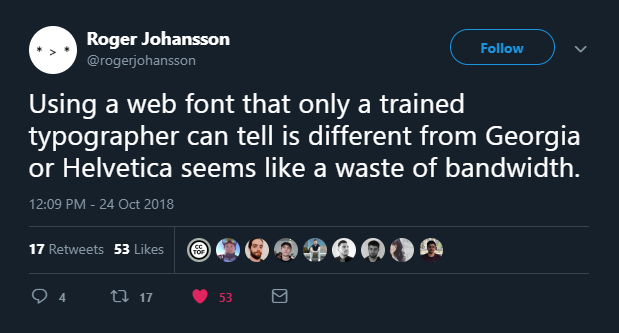

Web fonts are cool, but too many and they're slow as hell. If you're using a bunch of them, you're taking a hit in your website's performance. Not to mention if you're loading in the base font, the italics, the bold, the extra bold, etc . . .

Why not use the fonts already installed on your user's devices? I'm not talking about Arial and Times New Roman, come on, this is 2018 . . . it uses modern, system default typefaces on just about every device. They'll match up with the device's native font stack for a nice, comfortable experience.

Want to use a nice, modern sans-serif font?

```css
font-family: -apple-system, BlinkMacSystemFont, Segoe UI, Roboto, Oxygen, Ubuntu,
  Cantarell, Fira Sans, Droid Sans, Helvetica Neue, sans-serif;
```

For serif fonts for, say, body text, you can use Georgia:

```css
font-family: georgia, serif;
```

Need to show off a code block? For monospace fonts:

```css
font-family: "SFMono-Regular", Consolas, "Roboto Mono", "Droid Sans Mono",
  "Liberation Mono", Menlo, Courier, monospace;
```

And it looks damn nice, too. All the text on my website uses these fonts.

Save some performance off your website. Unless you want to use a font or two for some interesting headings, save some bandwidth and try these out.
