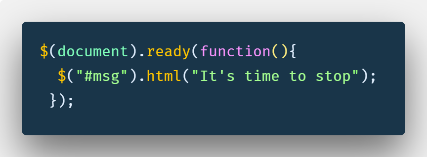

If you're learning web development in 2018—do yourself a favor and _don't_ learn jQuery.

What is jQuery? It's an old, dusty library that used to fill a real need in JavaScript. Back in the dark ages of JavaScript, it was a lot harder to make dynamic changes to an HTML page. If you wanted to create a slideshow, you could do it painstakingly with JavaScript—or you could just use jQuery. JQuery made it easy to manipulate the DOM (the HTML elements on the page) in a way that wasn't possible before. Remember when _every_ website needed a slideshow? That's when you turned to jQuery.

Plus, jQuery was easy to learn. There was tons of documentation, a big community, and a library of jQuery plugins at your disposal. It was how a lot of people got into web development back in the day.

So, what happened?

### How jQuery became irrelevant

Nothing happened to jQuery, per se. It's just that JavaScript got better.

Before there wasn't an easy way to select HTML nodes based on CSS selectors (e.g. "`.button`" "`#header`") in JavaScript. Then, JavaScript rolled out `document.querySelector`. Now you could do the same in vanilla JavaScript. Before, it was tedious to make an AJAX request with JavaScript, where jQuery made it simple. Then, JavaScript rolled out the Fetch API which made that unnecessary.

The biggest reasons to use jQuery were being supplanted by vanilla JavaScript moving forward.

### Why you shouldn't learn jQuery

There's not any real need for jQuery these days. With new, modern syntax, modifying the DOM with vanilla JavaScript is easier than ever. New technologies like CSS animations replaced the need for jQuery's out-of-the-box animations.

With all the functionality in modern JavaScript, it doesn't make sense to bring in a huge library of code you're only going to use a percentage of. What's the use, other than to slow your website down?

Not only that, JavaScript is moving away from direct DOM manipulation. These days, if you want to make a website with a lot of moving parts, you use a library like React or Vue. It uses different techniques to save performance off of modifying the DOM directly with JavaScript or jQuery. New, more efficient tools are making jQuery more irrelevant.

### Wait, but everyone still uses jQuery!

JQuery usage has been trending downward, but there's still plenty of uses of it on the web. Try opening up a WordPress site from the past ten years and you'll most likely find a mess of jQuery holding together a slideshow or an accordion.

If your passion is working on a bunch of old WordPress sites for Mom &amp; Pop's corner store, more power to you. But most modern companies are going to be using much more current tech stacks. There's not much point in being stuck in the past. You don't need to be the guy specializing in last year's frameworks.

### But, learning jQuery couldn't hurt, could it?

Well, it's one more thing to learn. Instead of jQuery, your time could be better spent getting yourself up to speed on something like React, vanilla JS, or a ubiquitous tool like Git.

If you do get a job where you _have_ to use it, then that's a legitimate reason to learn jQuery. It's not _that_ much work to learn, and the documentation is pretty solid. But why bother spending the mental energy if you don't have to?

Now, get out there and build some awesome things—without jQuery.
