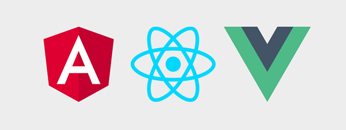

I always see these dumbass debates online about what framework is better. Well, is it React, Vue, or Angular? Should you build your backend with Ruby on Rails, Node and Express, or Prisma and GraphQL Yoga?

Am I crazy, or does none of this shit matter?

Here's what does matter. What do you know? What will get the job done? What's the most effective thing to learn to make what I want?

It's not sports. You don't have to root for your favorite technology. You can be happy using whatever technologies you want, without caring what other people think!

### Anything works

If you want to build something cool, you shouldn't give a fuck what you build it with.

I like Pieter Levels, because he _really_ didn't give a fuck about what stack to use, and yet he runs some insanely successful websites. Ever heard of Nomad List or RemoteOK? Huge websites.

He built everything with PHP. Definitely not the hottest technology to build a website, even a few years ago. Everybody likes to make jokes about how PHP sucks. Oh shit, I have to work on a PHP project, kill me now.

Sure, there's some stuff that sucks about PHP. But what if you want to build something, and all you know is PHP and a bit of JavaScript? Why should you learn something new if it works?

Sure, he has some people clown him. But when he launched Nomad List and got a ton of attention, he didn't know anything else. Should he have taken six months off to learn React/whatever? No, he should have kept building his shit! And that's what he did. Now he's making bank.

I love this quote from a [podcast interview he gave](https://www.indiehackers.com/podcast/043-pieter-levels-of-nomad-list):

> My brother tried to learn web development and he asked people what to use, and I said use whatever you know a little bit. He knew a little bit of JavaScript and PHP, but he said, no I'm going to learn Meteor because everyone says I need to learn Meteor. This was a few years ago and Meteor was hot. He went into this rabbit hole for two years I think. He came out he had shipped nothing but he could talk a lot about event bindings and all these weird terms, front and back end merging. But it wasn't the goal that he set in the beginning which was that he wanted to ship an app or a product.

If you want to make something, fucking make it! Would you rather create a bunch of cool shit, or be the guy who learned all these technologies and weird abstract shit without making anything?

### How I make things

I'm working on an app right now with the MERN stack, so MongoDB, Express, React and Node. It's not the hottest stack right now. If I wanted to be cool I could throw some Apollo in there and spin up a GraphQL server.

I _could_ learn all that before I start on this side project. But I know the MERN stack down cold, and I want to make something right now!

I'm not saying you should never learn something new. Obviously don't do that. But you don't always have to jump on the hot new technology right away.

I always cockblocked myself from making something cool because I thought I needed to learn X, Y, and Z before I was ready to build something for the world to see. But I was just making excuses for myself.

There's a lot to say for being really good at one or two things. If you're looking to hire a React developer, do you want to hire the girl who's an expert in React, or the guy who knows a little bit of React, Angular, Vue, and POPULAR\_NEW\_FRAMEWORK?

You don't need to know everything. You just need to know enough to get the job done!

There's no point in learning everything under the sun and every new thing that pops up. Get good at something, _anything_, and then build some awesome shit with it!