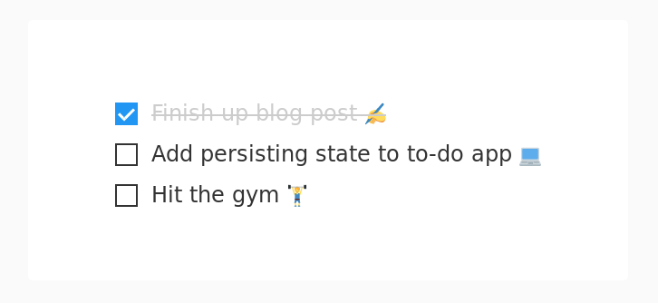
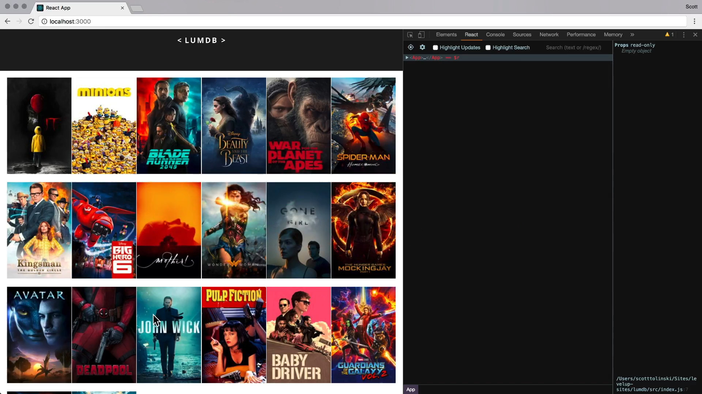
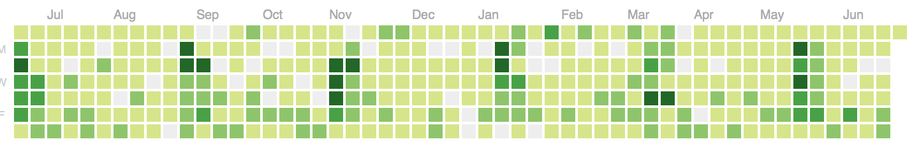
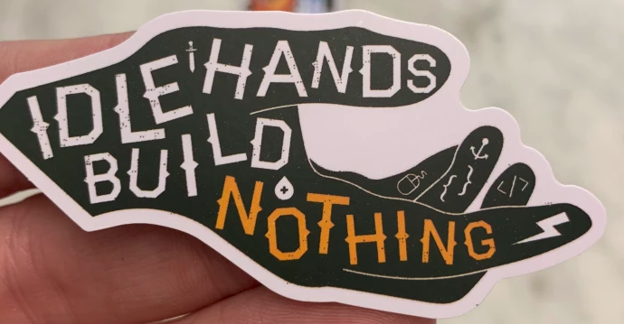

Following coding tutorials is a great way to learn how to code. That's how I learned to code, by watching videos on YouTube and following blog posts. Following along with someone else is a great way to get the basics of a new language.

But after taking so many tutorials, I thought, "now what"?

I knew a lot of syntax, but I was nowhere near a "real-life" developer. If you threw me into a decent-sized React project, I'd have no idea what to do. And if you gave me a project description and told me to get to work, well, I couldn't do that either.

Hmm. It's almost as though just watching endless tutorials isn't enough . . .

### How to learn for real life

I first learned HTML and CSS when I was a nerdy teenager. I didn't have a lot of friends and spent a lot of time at home, so I stayed inside and spent all day on my computer. With a little help from my dad, I learned the basics of making HTML sites, and I set up a fan website for my favorite video game character.

Remember this guy? His games were _the shit_!

I called it Kirby's Palace. It was a beautiful early-2000's design, the MySpace days of the internet. It was totally cool. I worked on adding new pages, fan art, and reviews every day.

I wasn't trying to "level up my skills" or anything. I just wanted to have fun and build cool shit! A `<blink>`ing `<marquee>`? Hell yes!

But now when you want to learn web design, it's all serious. I get it, you want to start a new career, get more money, and get new skills. Who doesn't? But if you want to apply your skills to real life, you have to get out there and build something!

### What do I build?

Build anything you want!

OK, I understand that maybe you don't have a lot of ideas. Build something that would be useful to you, but doesn't exist yet. Find a problem that annoys you that you wish somebody had solved already.

It doesn't have to be a unique idea. For example, I hate to-do list apps because they're so overengineered. I don't need a dozen different categories and colors and scheduling. _I'm looking at you, Todoist!_

All I need is a quick view of my three most important tasks for the day. That way, I can just focus on a few things every day instead of having a never-ending to-do list.

So I'm making a Chrome extension that'll display the three tasks I want to get done as a new tab page.

I built it with React Hooks to get better at those, as well as learn how to set up a new Chrome extension from scratch. I've never done that before, so I had to learn how to write a `manifest.json` file, use Chrome's storage API, get better at `styled-components`, and learn new things about HTML and CSS. (Did you know the `contenteditable` attribute was a thing? I sure didn't. It allows you to have a totally editable `div` instead of a normal `textarea` or `input`.)

I learned everything from trial-and-error, reading the documentation, and of course, looking everything up on Stack Overflow. Like you do in real life. I didn't follow any tutorials. I had to piece it together by myself.

That's how real-life projects work! You take some kind of fuzzy requirements and turn it into a real product. You have to fix bugs, try to make it as performant as possible, and learn how to Google relevant questions.

That's where the real learning comes from. You'll learn a lot more from getting your hands dirty than from copying code from a YouTube video.

For every tutorial or two, you should balance it out by building something in real life with it. It'll help you remember what you learned so much better.

### Be creative with tutorials

When you do watch a tutorial, be creative. Don't follow along exactly. Make it personal.

I remember watching a React tutorial from LevelUpTutorials. Great tutorial, but it involved grabbing an API list of movies from a movie database and displaying them in a grid.

Yawn, movies are so boring. Like I said, great tutorial, but I couldn't care less about movies.

But I love what Scott Tolinski (the guy who made the tutorial) said about his tutorials in a podcast episode.

> [Don't follow tutorials] one-to-one. I mean, you can, but maybe watch it again and don't follow it one-to-one[...] I try to take the source material that they're working with, [e.g.] we're building a to-do app, and I like to modify it slightly. OK, what's sort of like a to-do app? Maybe a grocery list or a resolutions app.

What are some other APIs you can grab that are more interesting than movies? Pokemon? Cryptocurrencies? Ghibli movies? Be creative! Take the tutorial in your own direction. Making a to-do list? Add more functionality: a description, a date, the ability to click and drag to reorder them. Up to you.

After you finish a tutorial, you should be thinking about ways you can apply what you learned into a real-life project.

### Try some project ideas from other people

You can take ideas from other people, too. When I was first learning JavaScript, I found the idea to make a tic-tac-toe game from FreeCodeCamp.

It bent my brain because I had no idea how to make anything like it. How do you make a tic-tac-toe grid? How do you make a turn system? Can you make a simple AI? How do you check who wins? It really got the problem-solving part of my brain working.

You can Google lists of practice JavaScript apps to get ideas of things you can build. Some of these ideas are total shit, some of them are great. Flavio Copes has a nice [list of potential web apps you could build](https://flaviocopes.com/sample-app-ideas/).

I always like working on solving personal problems and projects from my own ideas, because they're more interesting to me. But you can get inspiration from anywhere.

### Jump into other people's projects

In real life, you're probably not just working on your own projects. You have to jump into existing codebases and swim.

You can practice this by yourself. I was looking at this nice Chrome extension called [Another Tab](https://github.com/mmazzarolo/chrome-another-tab). It's a new tab extension that displays your bookmarks. But I actually use Firefox more often. I could fork it to make a Firefox version. The built-in backgrounds aren't that great, either. No dark mode? Seriously? I could fork it and add some more backgrounds, too.

Doesn't have to be anything huge. I had a client project working with WordPress's new Gutenberg builder. I was following the documentation, but the code examples didn't work! I fixed it myself in my code and submitted a pull request to change the example code. It feels \*\*badass when you have someone merge your pull request to a project thousands of people will use.

### Get in the habit of shipping something every day

I've always liked the idea of doing something every single day to make it into a habit. The only way to get better at coding and become a "real-life" developer is just to practice it, a lot. I try to push something to GitHub at least once a day. Because what could be more motivating than seeing a beautiful, green, contribution graph?

Disclaimer: Not my contribution graph, I'm not that productive.

I like the idea of these "maker communities" like [WIP](https://wip.chat/) and [Makerlog](https://getmakerlog.com/) that have gotten popular recently. It's a bunch of people, mostly independent developers or business owners, that get together to "ship" something every day. Whether that's shipping a new feature, bugfix, or finally launching a new product, you try to preserve your daily "ship" streak as long as possible.

Yes, writing this blog post counts.

Plus, you join a community of people working to get shit done together. Everyone knows [staying motivated](https://ericnmurphy.com/motivation/) is one of the hardest parts to really learning how to code.

### Make something!

OK, now I expect you to make something! No, this isn't a blog post to get you motivated without you actually doing anything. You need to get off your ass and get started with something. Take a recent tutorial you took and build something based off the technology. Doesn't have to be anything crazy. But it should be something that pushes your limits a little and that you can be proud of once you're finished.

I like the quote, "idle hands build nothing" (that I first heard from a web dev sticker pack, of all places). Stop consuming and start creating. After all, that's what becoming a developer is all about: building something from nothing!
